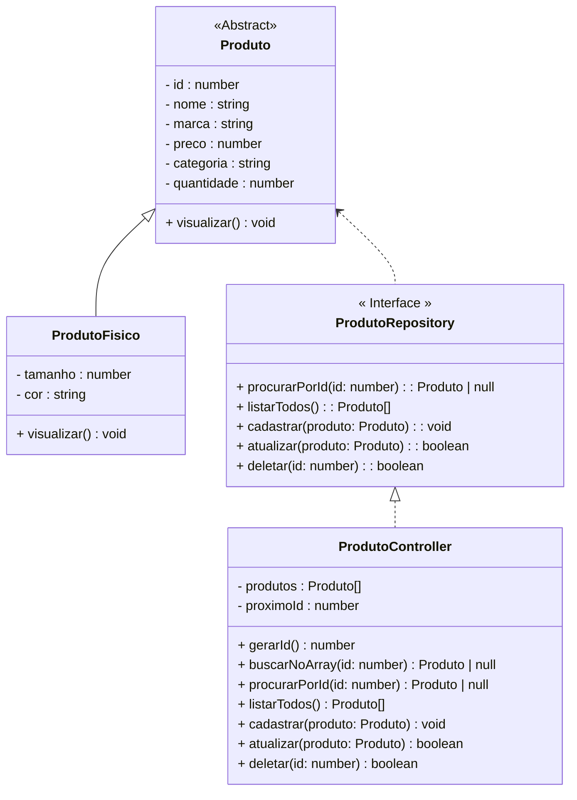

# Projeto Final - OFFSHOES E-COMMERCE (TypeScript)

<br />

## 1. Sobre o Projeto

O projeto **OFFSHOES - E-COMMERCE** é o resultado final do Bloco 01 do curso Generation Brasil, e utiliza como base todo o conhecimento adquirido durante o desenvolvimento do projeto Conta Bancária.  
Aqui, você irá manipular um sistema de cadastro de produtos (tênis) aplicando conceitos fundamentais de **Orientação a Objetos**, collections, laços, condições e tratamento de exceções, usando TypeScript e entrada de dados via terminal.

O objetivo principal é simular o gerenciamento de produtos em uma loja virtual, praticando:

- Criação de classes abstratas e concretas
- Encapsulamento, herança, polimorfismo e interface
- CRUD de produtos (tênis esportivos) via terminal
- Uso de collections (array de produtos)
- Tratamento de exceções (erros customizados)
- Entrada e saída de dados usando `readline-sync`

---

## 2. Estrutura do Projeto

| Classe/Interface        | Descrição                                                                 |
|------------------------ |--------------------------------------------------------------------------|
| **Menu**                | Classe principal (Menu.ts), responsável por exibir o menu, receber dados do usuário e acionar os métodos do sistema. |
| **Produto**             | Classe abstrata que define os principais atributos e métodos de um produto genérico. |
| **ProdutoFisico**       | Classe concreta que estende Produto, representa um tênis físico, com atributos adicionais como tamanho e cor. |
| **ProdutoRepository**   | Interface com os métodos do CRUD utilizados no controller.               |
| **ProdutoController**   | Implementação do CRUD, gerenciamento da collection (array privado) e lógica de ID incremental. |

---

### Exemplo de Diagrama de Classes (mermaid)



---

## 3. Como Executar o Projeto

**Pré-requisitos:**  
- Node.js  
- TypeScript  
- ts-node  
- readline-sync

### Instalação rápida

```bash
git clone https://github.com/diegocavalcanti-dev/projeto-javaScript.git
cd projeto-javaScript
npm install
```

### Rodando o projeto

```bash
ts-node Menu.ts
```
Ou, se seu arquivo principal tiver outro nome, ajuste o comando conforme necessário.

---

## 4. Funcionalidades

- **Cadastrar Produto:** Adicione um tênis com nome, marca, categoria, tamanho, cor, quantidade e preço.
- **Listar Produtos:** Veja todos os produtos cadastrados na loja.
- **Consultar Produto por ID:** Consulte as informações detalhadas de um produto específico.
- **Atualizar Produto:** Altere os dados de um produto cadastrado.
- **Apagar Produto:** Remova um produto do estoque.

---

## 5. Exemplo de Uso

```
*****************************************************
                   OFFSHOES - E-COMMERCE             
*****************************************************
            1 - Cadastrar Produto                    
            2 - Listar Produtos                      
            3 - Consultar Produto por ID             
            4 - Atualizar Produto                    
            5 - Apagar Produto                       
            6 - Sair                                 
*****************************************************

Entre com a opção desejada: 2

ID: 1
Nome: Nike Revolution
Marca: Nike
Categoria: Esportivo
Tamanho: 41
Cor: Preto
Quantidade em estoque: 10
Preço: R$ 299.90
...
```

---

## 6. Estrutura de Pastas

```
src/
  controller/
    ProdutoController.ts
  model/
    Produto.ts
    ProdutoFisico.ts
  repository/
    ProdutoRepository.ts
  util/
    Colors.ts
Menu.ts
```

---

## 7. Sobre

Projeto desenvolvido por  
**Diego Cavalcanti**  
[GitHub](https://github.com/diegocavalcanti-dev) | cavalcanti@hotmail.com

Projeto acadêmico | Generation Brasil - 2025

---
